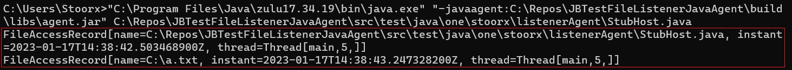

# File Listener Agent

The tool which prints the list of files used by instrumented program.



## Requirements

- Java 16 or later
- OS Windows

## Build

```shell
git clone https://github.com/Stoorx/JBTestFileListenerJavaAgent.git
cd JBTestFileListenerJavaAgent
./gradlew shadowJar
```

The agent will be in `build/libs/agent.jar` file.

## Run

### Attach to already running machine

```shell
java -jar agent.jar <VmId>
```

`VmId` is identifier of target machine.

### Use as agent

```shell
java -javaagent:agent.jar -jar <path/to/program.jar>
```

## Limitations

The current version of the agent supports `Windows` only. The agent will do nothing on the other platforms.